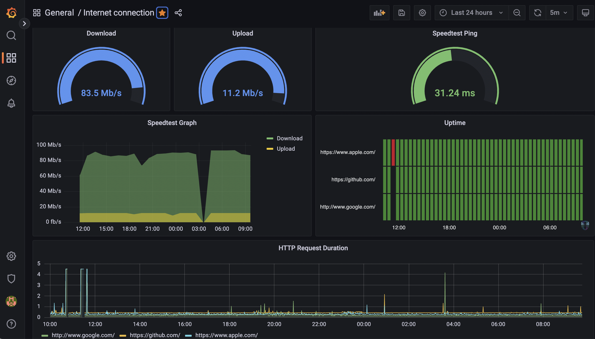

# Internet Pi (drio modifications)

These are my modifications on the Jeff's
[internet-pi](https://github.com/geerlingguy/internet-pi) projects. Kudos to
him for putting this together. I removed a few pieces that I don't use in my
setup. Mostly related to starklink, shelly-plug and the air gradient services.

The speedtest has a 60m scrape interval. If you check the targets health right
after starting the services you'll see the speedtest failed (at least for me).
Just let it run, it will catch up on the next scraping cycle.
